# 👋 Salut, moi c'est Jacob !

<div align="center">
  


</div>

---

## 🚀 À propos de moi

```javascript
const jacob = {
    localisation: "Bruxelles, Belgique 🇧🇪",
    formation: "École 19 (réseau 42)",
    ancienneFormation: "Solvay Brussels School - Économie",
    statut: "En recherche active d'opportunités",
    passion: ["Algorithmes", "Chess ♟️", "Voyages ✈️", "Football ⚽"],
    eloChess: "2000+ 🏆",
    langues: ["French (native)", "English (B2)"],
    philosophie: "Analyser, s'adapter, innover"
};
```

🎯 **Actuellement** : Développement full-stack avec React, NestJS et PostgreSQL dans le cadre du projet **Transcendence**

🔍 **Je recherche** : Un stage ou une opportunité en développement logiciel pour appliquer mes compétences techniques et ma pensée stratégique

---

## 🛠️ Stack Technique

### 💻 Langages de programmation 
<div align="center">

| C | C++ | JavaScript | HTML | CSS | Bash/Shell |
|:-:|:---:|:----------:|:----:|:---:|:---------:|
|  |  |  |  |  |  |

</div>

### 🔧 Frameworks, Outils & Infrastructure 
<div align="center">

| React | NestJS | PostgreSQL | Git | Docker | Linux |
|:-----:|:------:|:----------:|:---:|:------:|:-----:|
|  |  |  |  |  |  |

</div>

---

## 🏆 Projets Phares

<div align="center">

| 🚀 Projet | 📝 Description | 🔧 Technologies |
|-----------|---------------|------------------|
| **[Webserv](https://github.com/jmaizel)** | Serveur HTTP/1.1 complet en C++ from scratch | `C++` `Network Programming` `RFC Compliance` |
| **[Minishell](https://github.com/jmaizel)** | Shell Unix personnalisé avec pipes & redirections | `C` `System Programming` `Signal Handling` |
| **[Transcendence](https://github.com/jmaizel)** | App web full-stack avec temps réel | `React` `NestJS` `WebSockets` `PostgreSQL` |

</div>

---

## 📊 Statistiques GitHub

<div align="center">


</div>

---

## 🎯 Compétences Clés

```mermaid
mindmap
  root((Jacob))
    Technique
      Programmation Système
      Développement Web
      Network Programming
      Algorithmes
    Soft Skills
      Problem Solving
      Leadership
      Adaptabilité
      Travail d'équipe
    Expérience
      Management
      Gestion de projet
      Finance
      Opérations
```

<div align="center">



</div>

---

## 🏅 Certifications & Réalisations

- 🏫 **École 19 (42 Network)** - Formation en cours
- 🎓 **Solvay Brussels School** - 130/180 ECTS en Économie
- ♟️ **Chess.com** - Rating 2000+ ELO (Top 5% mondial)
- 💼 **6 ans d'expérience** en management et gestion d'équipe

---

## 📈 Activité de Contribution

<div align="center">


</div>

---

## 🤝 Connectons-nous !

<div align="center">

[](https://linkedin.com/in/jacob-maizel)
[](mailto:jacobmaizel@hotmail.com)
[](https://github.com/jmaizel)

📱 **+32 485 198 740**  
📍 **Bruxelles, Belgique**

</div>

---

<div align="center">


</div>

---

<div align="center">
<sub>⚡ Fun fact: Je peux résoudre un Rubik's Cube plus vite que je ne compile certains projets C++ ! 🎲</sub>
</div>
